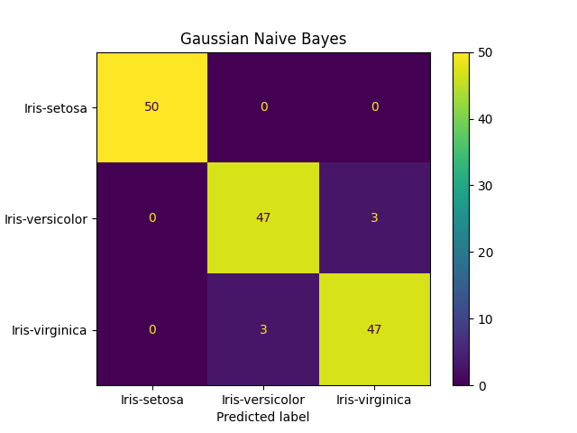
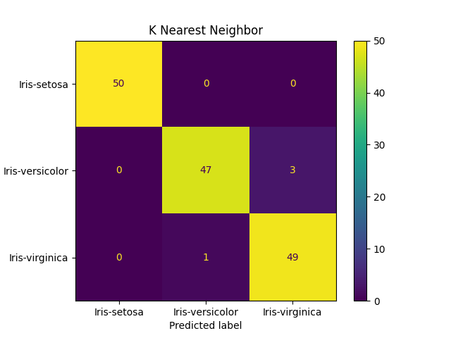
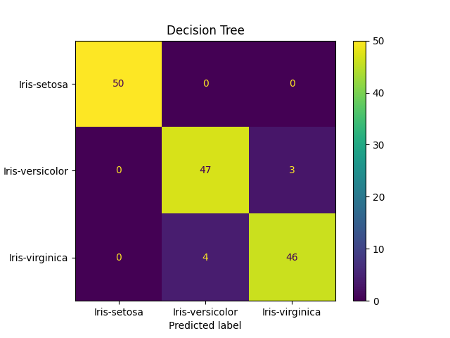

<h2> Machine Language Classifier Comparison </h2>

<section>
  <h4>Models used:</h4>
  <ol>
    <li>Naïve Bayes (NBClassifier) </li>
    <li>KNN (KNeighborsClassifier) </li>
    <li>SVM (svm.LinearSVC) </li>
    <li>Decision Tree (DecisionTreeClassifier) </li>
    <li>Random Forest (RandomForestClassifier) </li>
  </ol>
</section>
 
<section>
 <h4>Naive Bayes</h4>
 
  
Figure 1

  
In Figure 1, the mean ratio of the True False Positives and the True Negative is 48 out of 50 or 96%

</section>

 <h4>KNN</h4>
 
  
Figure 2

  
In Figure 2, the mean ratio of the True False Positives and the True Negative is 48.33 out of 50 or 96.67%

 <h4>SVM or Linear SVC</h4>
 
  
Figure 3

  
In Figure 3, the mean ratio of the True False Positives and the True Negative is 48.33 out of 50 or 96.67%

 <h4>Decision Tree</h4>
 
  
Figure 4

  
In Figure 4, the mean ratio of the True False Positives and the True Negative is 47.67 out of 50 or 95.33%

 <h4>Random Forest</h4>
 
  
Figure 5

  
In Figure 5, the mean ratio of the True False Positives and the True Negative is 48 out of 50 or 96%

  <section>
    <h3>Conclusion</h3>
    
KNN (K-Nearest Neighbor) and Linear SVC are tied for the most accurate results. While the Decision Tree made the least accurate predictions in the group. All the members of the group made correct predictions for the Iris-Setosa 100% of the time. KNN produced the best prediction for Iris-Virginica 

  <section>
